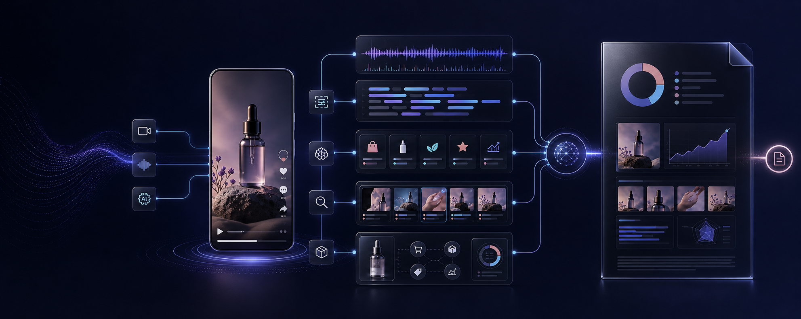
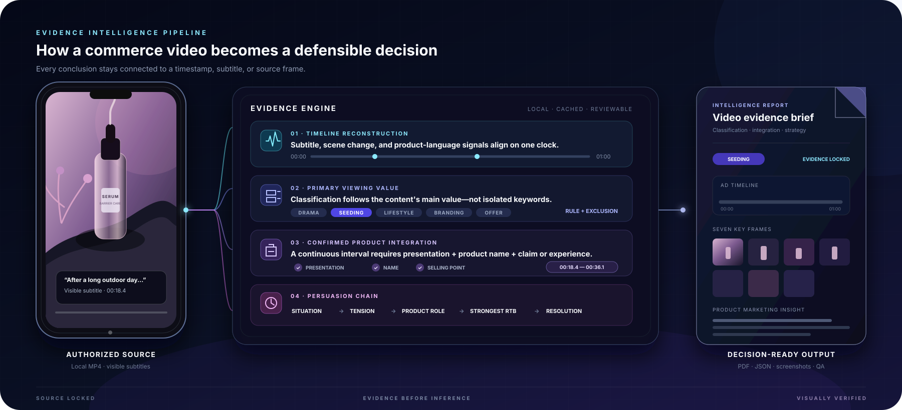
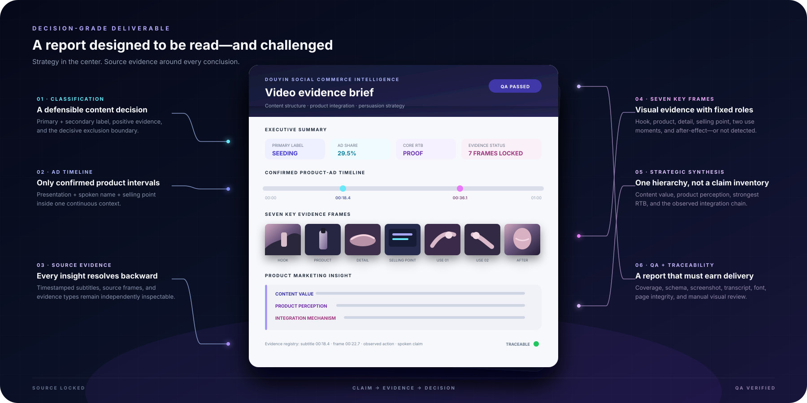

<p align="center">
  
</p>

<h1 align="center">Douyin Social Commerce Intelligence</h1>

<p align="center">
  <strong>Turn short-form commerce videos into traceable evidence, product insight, and decision-ready reports.</strong>
</p>

<p align="center">
  <a href="LICENSE"></a>
  
  
  
  
</p>

<p align="center">
  Local subtitle OCR · Evidence-backed classification · Product-integration analysis · Seven key frames · Verified PDF
</p>

---

## Intelligence, not just summarization

**Douyin Social Commerce Intelligence** is a local-first Codex Skill for analyzing authorized, subtitled Douyin seeding and ecommerce videos.

It reconstructs how a video earns attention, creates relevance, introduces a product, builds belief, and completes persuasion—then binds every important conclusion to recoverable subtitle or visual evidence.

> 中文简介：一套面向抖音种草与电商视频的本地分析工具。它沿着视频时间轴拆解内容结构、产品植入与卖点说服机制，并输出可追溯证据和专业报告。

The repository is named `douyin-commerce-intelligence`. The stable Skill command remains `$analyze-douyin-social-video`.

## Why this exists

A transcript explains what was said. A summary explains what happened. Neither necessarily explains why a video works.

This Skill is designed to answer deeper questions:

- What is the video's primary viewing value?
- Where does the consumer tension become concrete?
- Why does the product belong at that exact moment?
- Which claim, action, or frame does the persuasive work?
- What single product perception is the viewer likely to retain?
- Can every conclusion be traced back to the source video?

The result is not a black-box score. It is an auditable interpretation.

## How a video is decomposed

<p align="center">
  
</p>

### 1. Establish an evidence baseline

The pipeline imports an authorized local MP4, recovers visible subtitles with Apple Vision, and aligns subtitles, timestamps, and candidate frames.

Analysis continues only when subtitle coverage is complete. Partial evidence triggers a clear stop instead of a speculative report.

### 2. Reconstruct the content timeline

The video is organized into decision-relevant moments:

```text
Attention
→ Situation or tension
→ Product entry
→ Demonstration or claim
→ Reason to believe
→ Resolution or action
```

The system identifies the opening hook, narrative turns, product-language windows, use actions, effects, and calls to action without treating every repeated frame as evidence.

### 3. Determine the primary viewing value

Classification follows this priority:

```text
DRAMA → SEEDING → LIFESTYLE → BRANDING → OFFER → OTHERS
```

The decision is based on the video's main value—not keyword matching.

- Drama used only as a hook may still lead to `SEEDING`.
- If the content remains substantially intact without the product, it may be `LIFESTYLE`.
- Brand proposition and campaign assets point to `BRANDING`.
- Price, urgency, cart, or live-room mechanics must drive the video before it becomes `OFFER`.

Each result records one primary label, one secondary label, supporting timestamps, and the decisive exclusion boundary.

### 4. Confirm product integration

A visible product is not automatically an advertisement. A product-ad interval is confirmed only when one continuous context contains all three:

1. deliberate product presentation;
2. a spoken product name or unambiguous alias;
3. product introduction, selling point, efficacy claim, or usage experience.

The interval starts at the earliest qualifying event and ends at the last related presentation or statement. Incidental background exposure is excluded.

### 5. Reconstruct the persuasion mechanism

The Skill commits to:

- one demonstrated creator asset;
- one situated audience need;
- one product role;
- one core product perception;
- one core selling point;
- one strongest reason to believe;
- one observed three-to-five-node integration chain.

Reasons to believe are separated into:

| Evidence layer | What it establishes |
|---|---|
| **Sensoriality** | Texture, application, finish, comfort, or another visible usage cue |
| **Scientific language** | Ingredient, technology, specification, or mechanism |
| **Proof** | Comparison, repeated use, time-separated check-in, displayed result, or independently verified support |

An ingredient mention is scientific language—not proof of efficacy. Observed actions, creator claims, user feedback, displayed data, external proof, and analyst inference remain distinct throughout the report.

### 6. Select visual evidence and verify the report

The pipeline selects seven fixed evidence slots:

```text
cover · product_alone · product_detail · selling_point
use_process_1 · use_process_2 · after_effect
```

Every selected frame includes a timestamp and supporting context. If a required scene does not exist, it is marked `not_detected`; unrelated images are never used as substitutes.

The final PDF is rendered and visually checked for clipping, missing images, unreadable text, incorrect screenshots, and transcript integrity before delivery.

## From evidence to strategy

The report synthesizes three levels of insight:

- **Content value** — the creator asset, familiar theme, distinctive angle, and viewer payoff.
- **Product perception** — the product's role in the situation, its core selling point, and the strongest supporting evidence.
- **Integration mechanism** — how the need arises, why the product enters, what completes persuasion, and how the content resolves.

A typical integration chain might look like:

```text
Recognizable situation
→ Concrete consumer tension
→ Product enters as a functional solution
→ Usage evidence supports the selling point
→ The original content line is resolved
```

The Skill analyzes mechanisms demonstrated in the current video. It does not invent traffic, conversion, sales, budget, or future creator-performance claims.

## Deliverables

<p align="center">
  
</p>

```text
output/
├── report.pdf
├── analysis.json
├── transcript.json
├── evidence.json
├── screenshots/
├── run-state.json
└── qa/qa.json
```

| Deliverable | Purpose |
|---|---|
| `report.pdf` | Decision-ready visual report |
| `analysis.json` | Structured labels, intervals, evidence, and strategy |
| `transcript.json` | Timestamped visible subtitles |
| `evidence.json` | Subtitle, frame, and claim traceability |
| `screenshots/` | Seven key evidence frames |
| `run-state.json` | Stage status, timing, cache, and error |
| `qa/qa.json` | Deterministic and manual report QA |

## Design principles

| Principle | Implementation |
|---|---|
| **Evidence before inference** | Conclusions resolve to timestamps, subtitles, frames, or clearly marked inference. |
| **One message hierarchy** | One core perception and selling point take priority over claim accumulation. |
| **Clear failure states** | Incomplete visible subtitles stop the workflow. |
| **Local-first privacy** | OCR runs locally on macOS; no remote speech recognition is bundled. |
| **Human-verifiable output** | Reports, screenshots, evidence indexes, and QA records remain inspectable. |

## Quick start

### Requirements

- macOS 13+
- Python 3.10+
- FFmpeg and FFprobe
- Poppler
- Xcode Command Line Tools
- Apple Vision

```bash
brew install ffmpeg poppler
xcode-select --install

python3 -m venv .venv
source .venv/bin/activate
python -m pip install -r requirements.txt
```

### Install the Skill

```bash
mkdir -p "$HOME/.agents/skills"
cp -R skills/analyze-douyin-social-video "$HOME/.agents/skills/"
```

You can also ask Codex's `$skill-installer` to install the Skill from `skills/analyze-douyin-social-video` in this repository.

### Run an analysis

Use a video you own or are authorized to analyze and that contains complete visible subtitles:

```text
$analyze-douyin-social-video analyze /absolute/path/video.mp4 in Standard mode
```

## Analysis modes

| Mode | Best for | Review depth |
|---|---|---|
| `standard` | Routine social-commerce analysis | Compact evidence and targeted visual QA |
| `forensic` | Dense edits or high-stakes review | Denser sampling and full-detail inspection |

Standard mode is the default. Both modes use the same classification and evidence standards.

## Scope and boundaries

The current strategy methodology is optimized for skincare and beauty social-commerce content. The classification and evidence pipeline can be extended to other consumer categories with category-specific selling-point rules.

This repository:

- defaults to authorized local MP4 input;
- does not bundle a Douyin downloader, cookies, API keys, or remote transcription;
- permits URL mode only through a user-configured `DOUYIN_DOWNLOADER` adapter;
- does not treat creator claims as independently verified scientific facts;
- does not infer traffic, engagement, conversion, or sales without performance data.

Do not commit client videos, subtitles, screenshots, reports, credentials, or private analysis artifacts.

This project is independent and is not affiliated with or endorsed by Douyin. 

## Development

```bash
python -m pip install -r requirements-dev.txt
python -m unittest discover -s skills/analyze-douyin-social-video/tests -v
python scripts/validate_repo.py --public
```

End-to-end execution requires macOS Apple Vision, FFmpeg, and Poppler. CI runs deterministic tests and release-hygiene checks without shipping real platform videos.

## Project status

`0.1.0` is a public release candidate. The remaining release steps are tracked in [`PUBLISHING_CHECKLIST.md`](PUBLISHING_CHECKLIST.md).

The objective is not to generate more commentary about videos. It is to make short-form commerce analysis traceable, reviewable, and useful for real content and product decisions.

## License

Original code and documentation are available under the [MIT License](LICENSE). Third-party videos, music, likenesses, and brand assets are not included in that license.
